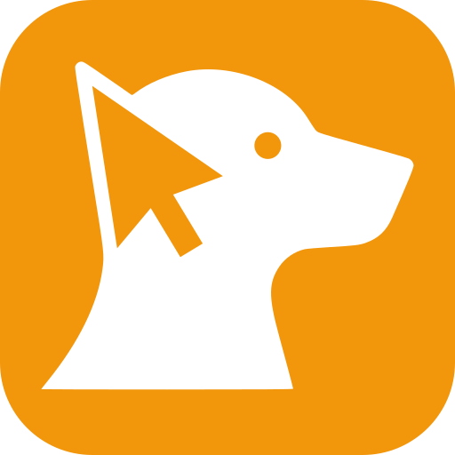

<p align="center">
  <picture>
    <source media="(prefers-color-scheme: dark)" srcset="docs/assets/click-dog-logo-light.svg">
    
  </picture>
</p>

# Click-Dog

> [!NOTE]
> **Public beta.** Click-Dog is newly open source — the public API and config may still change. It has been extensively tested and running in production for months.

Operational query observability without making the source system harder to run.

Click-Dog turns database telemetry into traces, dashboards, and query-analysis
signals for OTEL-compatible backends such as Datadog, Honeycomb, Grafana Tempo,
and more. Today it reads ClickHouse `system.opentelemetry_span_log` for live
telemetry and `system.query_log` for historical backfill; additional source
adapters are planned.

It is deliberately low-impact: zero DDL, read-only connections, bounded export
volume, SQL-level filtering, circuit breaker protection, and adaptive backoff so
telemetry collection stays manageable in production.

## Install

### Recommended: verified installer

The installer verifies release artifacts with a cosign-signed `checksums.txt`
before installing and fails closed if anything is missing or tampered with.
Inspect the script first if you want to read what runs.

```bash
curl -fsSL https://github.com/coltconsulting/click-dog/releases/latest/download/install.sh -o install.sh
less install.sh           # inspect (optional)
sudo bash install.sh      # guided quickstart
# or unattended:
sudo env CLICKHOUSE_PASSWORD=... bash install.sh install -c <collector-host>:4317 --systemd
```

Requires the [cosign CLI](https://docs.sigstore.dev/cosign/installation/) on
PATH. See [docs/install.md](docs/install.md) for Ansible, Kubernetes, and
Docker deployment modes.

### Manual download (verify yourself)

If you cannot run the installer, follow the verified manual recipe at
[docs/install.md#verifying-releases-manually](docs/install.md#verifying-releases-manually).
It walks through fetching the archive plus the cosign-signed `checksums.txt`,
verifying the signature against the pinned release-workflow identity, and
verifying the archive's SHA-256 against the signed manifest before extraction.

Do not skip the verification steps — the raw download URL is a single TLS hop
away from anything that owns your release distribution path.

### Build from source

```bash
git clone https://github.com/coltconsulting/click-dog.git
cd click-dog
make build
```

## Quick Start

Create `click-dog.yaml`:

```yaml
clickhouse:
  host: localhost
  port: 9000
  username: default
  password: ${CLICKHOUSE_PASSWORD}

exporters:
  otel:
    - collector_address: localhost:4317
      service_name: click-dog-monitor

monitor:
  enabled: true
  min_trace_duration_ms: 1000
  check_interval_s: 30

log_level: info
```

Run it:

```bash
export CLICKHOUSE_PASSWORD="..."
click-dog -config click-dog.yaml
```

Validate config without running:

```bash
click-dog -validate -config click-dog.yaml
```

> **Datadog dashboards:** the config above exports traces only — enough for the
> **Application Query Analysis** dashboard (`click-dog create-dashboards
> --dashboard query`). The **Health** dashboard reads click-dog's own metrics.
> For the OTLP path, enable `metrics.otlp.enabled: true`. The
> installer-generated / `click-dog init --profile production` configs enable the
> Prometheus `/metrics` endpoint for the legacy Datadog Agent OpenMetrics scrape
> fallback — see
> [Datadog § Self-Monitoring](docs/integrations/datadog.md#click-dog-self-monitoring).

## Modes

| Mode | Usage |
|------|-------|
| **Scheduled** (default) | Continuous polling with circuit breaker + adaptive backoff |
| **Backfill** | One-shot historical export over an RFC 3339 range: `-backfill-start YYYY-MM-DDT00:00:00Z -backfill-end YYYY-MM-DDT00:00:00Z` |
| **Validate** | Check config and exit: `-validate` |
| **Dry-run** | Read real data, discard exports, print a one-shot summary and exit: `--dry-run` |
| **Analyze** | Local read-only query reports: `analyze queries` and `analyze trace` |

`click-dog deploy <kubernetes\|docker\|status>` is a separate subcommand
family that emits deployment manifests or reports installed state —
see [Operation Modes](docs/modes.md#click-dog-deploy-manifest-generators).

## Documentation

- [Install Guide](docs/install.md) — single-node `install.sh`, Kubernetes / Docker template rendering, Ansible playbook for fleet rollouts
- [Configuration Reference](docs/configuration.md) — narrative reference; [config.yaml.example](config.yaml.example) is the fully commented YAML companion
- [Operation Modes](docs/modes.md) — scheduled, backfill, validate, dry-run, analyze, and deploy
- [Observability](docs/observability.md) — `/metrics`, `/healthz`, `/readyz`, `/status`, webhooks, per-sink export counters
- [Operating Contract](docs/operating.md) — beta delivery guarantees & loss windows, compatibility matrix, performance tuning, cost estimation, cluster/sidecar topology, config-at-scale
- [Span Attributes](docs/span-attributes.md) — live spans, backfill query attributes, normalized query family
- [Datadog](docs/integrations/datadog.md) / [Honeycomb](docs/integrations/honeycomb.md) / [Generic OTLP](docs/integrations/generic-otlp.md) — backend integration guides
- [Architecture](docs/architecture.md) — source, processing pipeline, sinks, and deployment topology

## Building

```bash
make build          # Static binary (CGO_ENABLED=0) for current platform
make build-amd64    # Linux AMD64
make build-arm64    # Linux ARM64
make test           # Unit tests
make test-race      # With race detector
make lint           # golangci-lint
make integration    # Full integration suite (requires Docker)
```

## Security

To report a vulnerability, see [SECURITY.md](SECURITY.md). Please do not open a public GitHub issue for security reports.

## Contributing

Contributions are welcome under the [Apache 2.0 License](LICENSE) and require a [DCO](https://developercertificate.org/) `Signed-off-by` trailer on every commit (`git commit -s`). See [CONTRIBUTING.md](CONTRIBUTING.md).

## License & Trademarks

Source code is licensed under [Apache 2.0](LICENSE).

"Click-Dog" is an unregistered trademark of Colt Consulting Ltd. Apache 2.0 does not grant rights to use the trademark; see [TRADEMARKS.md](TRADEMARKS.md) for the policy. Third-party attributions are in [NOTICE](NOTICE).
